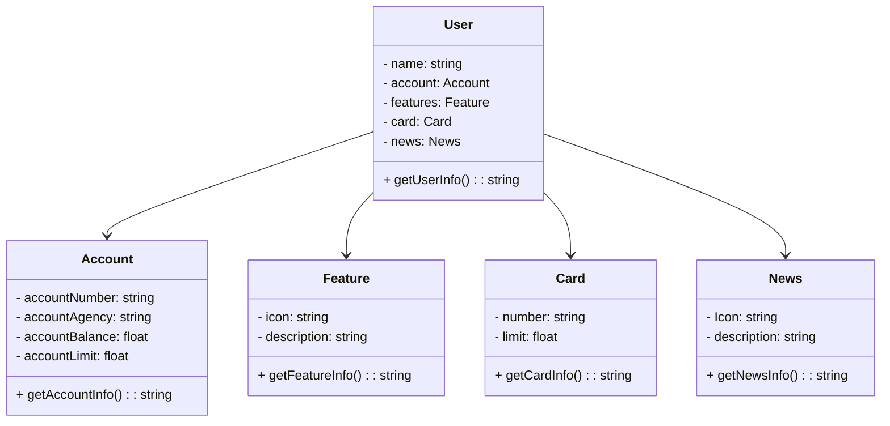

# Santander Dev Week 2023

##Diagrama de classes

```mermaid

classDiagram
    class User {
        - name: string
        - account: Account
        - features: Feature
        - card: Card
        - news: News
        + getUserInfo(): string
    }

    class Account {
        - accountNumber: string
        - accountAgency: string
        - accountBalance: float
        - accountLimit: float
        + getAccountInfo(): string
    }

    class Feature {
        - icon: string
        - description: string
        + getFeatureInfo(): string
    }

    class Card {
        - number: string
        - limit: float
        + getCardInfo(): string
    }

    class News {
        - Icon: string
        - description: string
        + getNewsInfo(): string
    }

    User --> Account 
    User --> Feature 
    User --> Card 
    User --> News 

```
